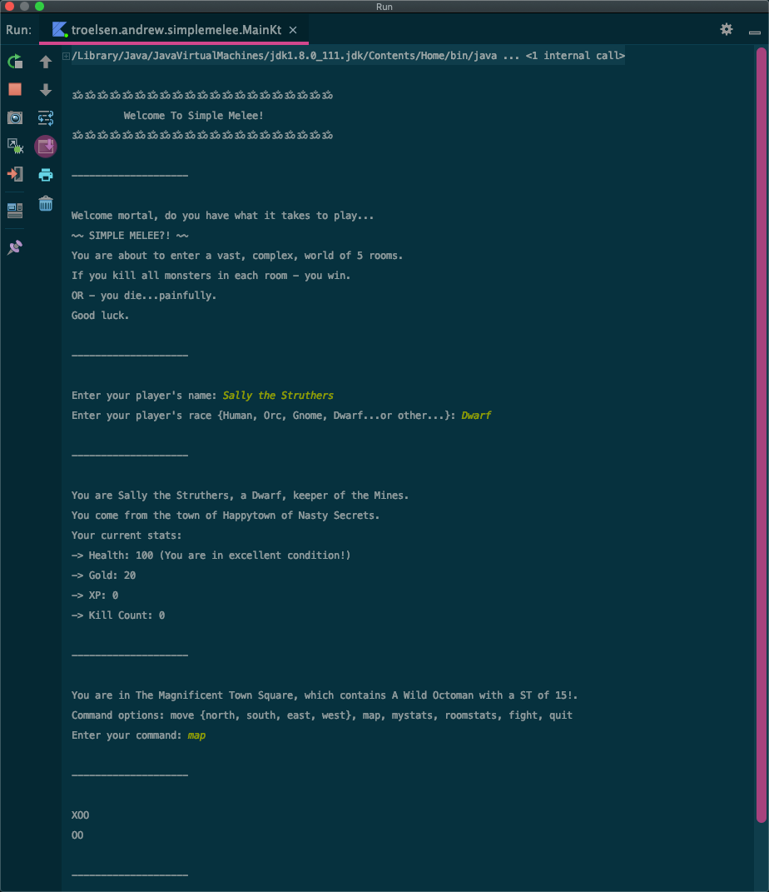

## SimpleMelee-V2
During a project at Starkey I was asked to build an Android app with Kotlin.  

Problem - I never used Kotlin...and never held an Android phone! 

So, I found a great book by [https://www.bignerdranch.com](https://www.bignerdranch.com) on Kotlin and built the following terminal driven role playing game. 

Years ago (many years ago) when I was round 14, I found a pencil and paper role playing game called The Fantasy Trip. One component of this system was called Melee - a combat system. 

So this game is a tip-of-the-hat to the work [Steve Jackson](http://www.sjgames.com) did. 

As luck would have it, this system was re-released thanks to KickStarker! Check it out: [https://thefantasytrip.game](https://thefantasytrip.game)

If you would like to download and run this game, please do!  Be sure you have installed the IntelliJ IDE ([link](https://www.jetbrains.com/idea/)) then open the project. 

If you want to add your own flare to this simple game - please do!  Maybe we can all build the next generation ZORK. 

Cheers - Andrew

